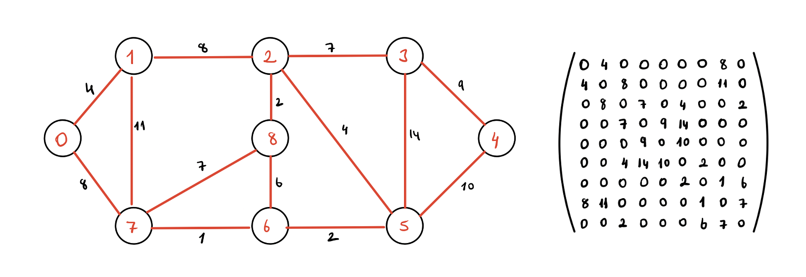

# The implementation of Dijkstra algorithm with python 

## Dijkstra Algorithm

The algorithm is one of the most popular search algorithm used to determine the shortest path between two nodes in the graph. It was designed by computer scientist Edsger W. Dijkstra in 1956 and published three years later. The algorithm can be applied to any problem that can be represented as graph. 

## How it works

The algorithm find the shortest paths from the source to all vertices in a given graph and a source vertex in the graph. A shortest path tree is generated with a given source as a root.

The graph should be shown as adjacency matrix. For example, notice this graph with its adjacency matrix:


Dijkstra's algorithm is applicable for:
* Both directed and undirected graph
* All edges should have nonnegative weights 
* The graph should be connected 

1. A set setSpt (set of shortest path tree) is created. It keeps track of the vertices whose minimum distance from the source is calculated and finalized. In the beginning of the program, this set is empthy.  

2. A distance value is assigned to all vertices in the input graph. All distance values are initilized as infinite. The distance value is assigned as 0 for the source vertex so that it will be picked first. 

3. While setSpt doesn’t include all vertices 
    * Pick a vertex u which is not there in setSpt and has a minimum distance value. 
    * Include u to setSpt. 
    * Update distance value of all adjacent vertices of u. 
4. To update the distance values, iterate through all adjacent vertices. For every adjacent vertex v, if the sum of distance value of u (from source) and weight of edge u-v, is less than the distance value of v, then update the distance value of v. 

## Example Code 
````py
g = Graph(9)
wmat = g.graph = [
        [0, 4, 0, 0, 0, 0, 0, 8, 0],
        [4, 0, 8, 0, 0, 0, 0, 11, 0],
        [0, 8, 0, 7, 0, 4, 0, 0, 2],
        [0, 0, 7, 0, 9, 14, 0, 0, 0],
        [0, 0, 0, 9, 0, 10, 0, 0, 0],
        [0, 0, 4, 14, 10, 0, 2, 0, 0],
        [0, 0, 0, 0, 0, 2, 0, 1, 6],
        [8, 11, 0, 0, 0, 0, 1, 0, 7],
        [0, 0, 2, 0, 0, 0, 6, 7, 0] 
        ];
g.dijkstra(0);
````

Output:

````

Vertex  Distance from Source
0        0
1        4
2        12
3        19
4        21
5        11
6        9
7        8
8        14
````
## Time complexity

The program searchs through all vertices to find the closest within the graph. This means that the initial time complexity will be O(n) for this search. This will bring the total time complexity to O(V^2) where V is the number of vertices in the graph. 

* For each vertex (V), the connected edges need to be relaxed in order to find the minimum cost edge that connects a vertex to V. V number of calculations need to be done and each operation takes O(V) times, therefore the time complexity will be  O(V^2).
     * V calculation 
     * Q(V) time
     * Total: Q(V^2)

